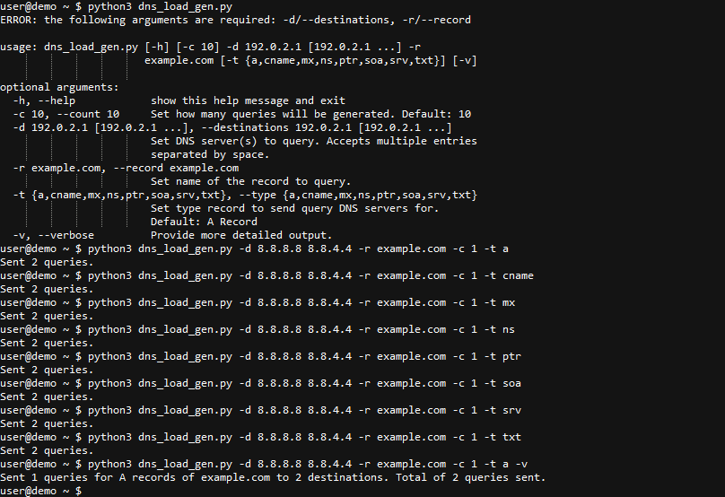

# DNS Load Generator

DNS Load Generator is a DNS query load generator script written in Python3.

This forked version of [ppdns_stress](https://github.com/VigneshSP94/ppdns_stress) leverages the Python [argparse](https://docs.python.org/3/library/argparse.html) module to accept user input from CLI and then generate DNS queries of various record types towards DNS servers.

## Screenshots




## Installation

**Method 1 - Run the Script**
1. Run the script! There are no dependencies other than Python3.

**Method 2 - Create a Python Venv**
1. Browse to the project folder.
2. Create Python Virtual Environment [(venv)](https://docs.python.org/3/library/venv.html) and activate it.
3. Install the package requirements by running `pip install -r requirements.txt`.
4. Run the script!

```
cd ppdns_stress
python3 -m venv .
pip install -r requirements.txt
python ppdnstress.py
```

## Usage

This version of DNS Load Generator has been modified to include command line arguments. This is useful for generating queries quickly without needing to manually input settings every time.

```
user@demo ~ $ python3 ppdnstress.py -h
usage: ppdnstress.py [-h] [-c 10] -d 192.0.2.1 [192.0.2.1 ...] -r example.com
                     [-t {a,cname,mx,ns,ptr,soa,srv,txt}] [-v]

optional arguments:
  -h, --help            show this help message and exit
  -c 10, --count 10     Set how many queries will be generated. Default: 10
  -d 192.0.2.1 [192.0.2.1 ...], --destinations 192.0.2.1 [192.0.2.1 ...]
                        Set DNS server(s) to query. Accepts multiple entries
                        separated by space.
  -r example.com, --record example.com
                        Set name of the record to query.
  -t {a,cname,mx,ns,ptr,soa,srv,txt}, --type {a,cname,mx,ns,ptr,soa,srv,txt}
                        Set type record to send query DNS servers for.
                        Default: A Record
  -v, --verbose         Provide more detailed output.
```
